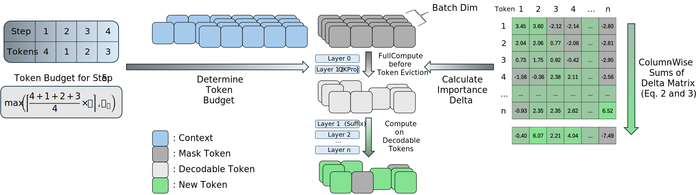
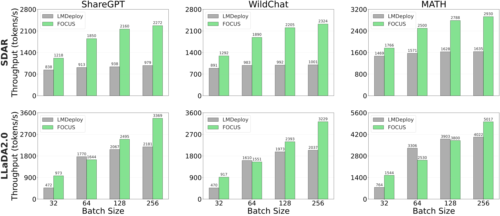

# FOCUS

FOCUS is an inference system for diffusion LLMs (DLLMs) built on top of the [LMDeploy](https://github.com/InternLM/lmdeploy) engine. It targets a key compute-bound bottleneck in block-diffusion decoding: models compute over a full token block each step, yet only a small fraction of tokens are actually decodable.

FOCUS uses attention-derived token importance from early layers to predict which tokens are likely decodable, then evicts non-decodable ones on the fly to avoid redundant computation. This training-free strategy increases the effective batch size and enables scalable throughput. FOCUS achieves up to **3.52× throughput** improvement without compromising quality across benchmarks. This repo contains the LMDeploy-based implementation for [SDAR](https://github.com/JetAstra/SDAR) and [LLaDA2.0](https://github.com/inclusionAI/LLaDA2.0)-mini.

## Design Overview



## Efficiency Improvement



## Key Implementation Files (FOCUS)

Based on LMDeploy, the main FOCUS-related implementations are in:

- [`lmdeploy/pytorch/kernels/cuda/focus.py`](lmdeploy/pytorch/kernels/cuda/focus.py): Triton kernels for importance scoring, target selection, and state compaction.
- [`lmdeploy/pytorch/kernels/cuda/pagedattention.py`](lmdeploy/pytorch/kernels/cuda/pagedattention.py): attention kernels (including ragged paged attention).
- [`lmdeploy/pytorch/kernels/cuda/fill_kv_cache.py`](lmdeploy/pytorch/kernels/cuda/fill_kv_cache.py): KV-cache fill kernels (including sparse KV fill for paged attention).
- [`lmdeploy/pytorch/models/sdar.py`](lmdeploy/pytorch/models/sdar.py): FOCUS eviction integrated into SDAR layers.
- [`lmdeploy/pytorch/models/llada2.py`](lmdeploy/pytorch/models/llada2.py): FOCUS eviction integrated into LLaDA2.0-mini layers.
- [`lmdeploy/pytorch/strategies/dllm/sequence.py`](lmdeploy/pytorch/strategies/dllm/sequence.py): FocusState tracking and per-step statistics.
- [`lmdeploy/pytorch/strategies/dllm/model_inputs.py`](lmdeploy/pytorch/strategies/dllm/model_inputs.py): focus-specific inputs for DLLM batches.
- [`lmdeploy/pytorch/model_inputs.py`](lmdeploy/pytorch/model_inputs.py): focus runtime view and host/device synchronization.
- [`lmdeploy/pytorch/engine/inputs_maker.py`](lmdeploy/pytorch/engine/inputs_maker.py): builds focus masks and pinned buffers for delayed cache batches.
- [`lmdeploy/pytorch/engine/model_agent.py`](lmdeploy/pytorch/engine/model_agent.py): propagates processed positions back to the scheduler.

## Install (CUDA)

FOCUS relies on Triton CUDA kernels and is intended for CUDA GPUs.
LMDeploy's default prebuilt wheels target CUDA 12 (since v0.3.0); RTX 50-series GPUs require CUDA 12.8 wheels.
CUDA 11+ is supported when building from source, but ensure your local CUDA toolkit matches your PyTorch/Triton stack.

1. Create and activate a Python environment.
2. Install runtime dependencies:

```bash
pip install -r requirements/runtime_cuda.txt
```

3. Install the repo using the PyTorch engine:

```bash
DISABLE_TURBOMIND=1 pip install -e .
```

## Benchmarking

All scripts write logs to `./results`. Run them from the repo root.

- FOCUS throughput: [`benchmark/run_focus_throughput_evaluation.sh`](benchmark/run_focus_throughput_evaluation.sh)

```bash
benchmark/run_focus_throughput_evaluation.sh <dataset_id> <model_id> [alpha]
```

Example:

```bash
benchmark/run_focus_throughput_evaluation.sh anon8231489123/ShareGPT_Vicuna_unfiltered JetLM/SDAR-8B-Chat-b32
benchmark/run_focus_throughput_evaluation.sh anon8231489123/ShareGPT_Vicuna_unfiltered JetLM/SDAR-8B-Chat-b32 1.8
```

Notes:
- For `hendrycks-MATH` datasets, the script automatically sets `--dataset-format math`.
- FOCUS uses `--dllm-enable-delayed-cache` and `--dllm-enable-focus` with `--dllm-focus-alpha` (default: 1.5).

- LMDeploy throughput: [`benchmark/run_baseline_throughput_evaluation.sh`](benchmark/run_baseline_throughput_evaluation.sh)

```bash
benchmark/run_baseline_throughput_evaluation.sh <dataset_id> <model_id>
```

Example:

```bash
benchmark/run_baseline_throughput_evaluation.sh anon8231489123/ShareGPT_Vicuna_unfiltered JetLM/SDAR-8B-Chat-b32
```

Notes:
- For `hendrycks-MATH` datasets, the script automatically sets `--dataset-format math`.
- Base uses `--dllm-confidence-threshold 0.9` without FOCUS.

- Block size comparison for SDAR: [`benchmark/run_block_size_comparison.sh`](benchmark/run_block_size_comparison.sh)

```bash
benchmark/run_block_size_comparison.sh <dataset_id>
```

This runs SDAR models `JetLM/SDAR-8B-Chat-b16` and `JetLM/SDAR-8B-Chat-b64` for both FOCUS and Base settings.

- Delayed cache baseline for SDAR: [`benchmark/run_sdar_delayed_cache_benchmark.sh`](benchmark/run_sdar_delayed_cache_benchmark.sh)

```bash
benchmark/run_sdar_delayed_cache_benchmark.sh <dataset_id>
```

This runs `JetLM/SDAR-8B-Chat-b32` with delayed cache enabled and FOCUS disabled.

Dataset notes:
- `dataset_id` can be a HuggingFace dataset ID or a local JSON/JSONL path supported by `benchmark/profile_throughput.py`.
- HuggingFace dataset IDs require the `datasets` package and network access.

## Generation Quality Testing

For generation quality evaluation of SDAR/LLaDA2.0-mini models, see [`opencompass-0.5.1.post1/README.md`](opencompass-0.5.1.post1/README.md) for OpenCompass benchmarking instructions with either HuggingFace/Transformers or LMDeploy backends.

## Acknowledgements

FOCUS builds on and/or includes code and models from:

- [LMDeploy](https://github.com/InternLM/lmdeploy)
- [OpenCompass](https://github.com/open-compass/opencompass) (vendored snapshot under `opencompass-0.5.1.post1/`)
- SDAR: [JetAstra/SDAR](https://github.com/JetAstra/SDAR) | weights: [JetLM/SDAR-8B-Chat-b16](https://huggingface.co/JetLM/SDAR-8B-Chat-b16), [JetLM/SDAR-8B-Chat-b32](https://huggingface.co/JetLM/SDAR-8B-Chat-b32), [JetLM/SDAR-8B-Chat-b64](https://huggingface.co/JetLM/SDAR-8B-Chat-b64)
- LLaDA2.0: [inclusionAI/LLaDA2.0](https://github.com/inclusionAI/LLaDA2.0) | weights: [inclusionAI/LLaDA2.0-mini](https://huggingface.co/inclusionAI/LLaDA2.0-mini)
